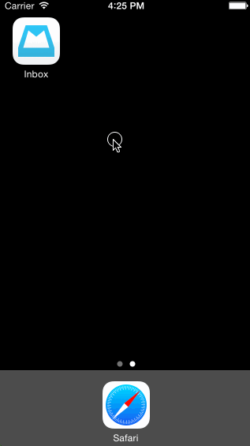

# Week3-Inbox
<b> Overview - </b>
In this project, I used a variety of animations and gestures to prototype the experience of archiving, deleting, rescheduling or adding a reminder
  to a message in the inbox.
  
<b> Tasks Completed - </b>
All tasks and milestones of the assignment were completed including the following optional tasks...
- Panning from the edge should reveal the menu
- If the menu is being revealed when the user lifts their finger, it should continue revealing.
- If the menu is being hidden when the user lifts their finger, it should continue hiding.

<b> Time spent - </b>
I spent a good 8 - 10 hours doing this assignment over the course of two days (Wed - Thu). 

<b> Demo </b>

